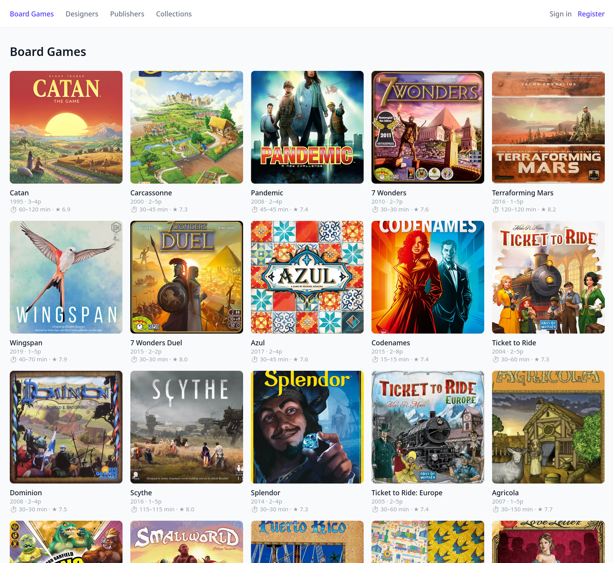
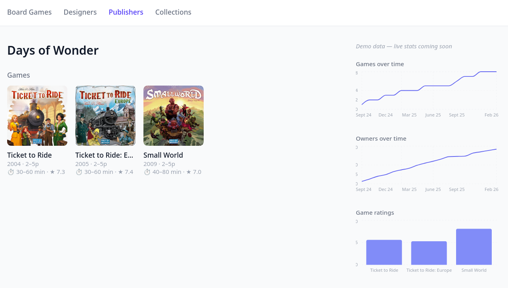
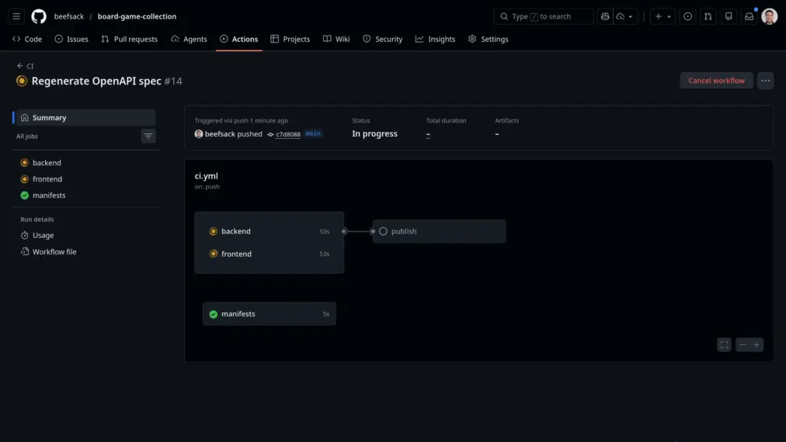
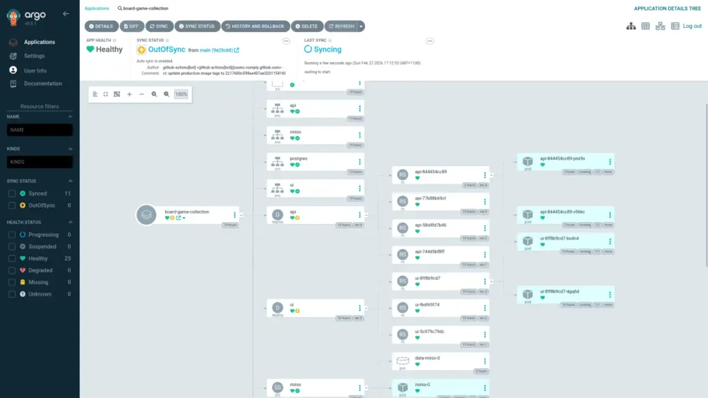

# Board Game Collection

A full-stack web application for managing a personal board game catalogue. Built as a portfolio piece demonstrating production-ready patterns across the stack.

Live: **https://board-game-collection.beefsack.com**




---

## Stack

| Layer | Technology |
|---|---|
| Backend | Kotlin + Spring Boot 4 |
| Frontend | React + TypeScript + Vite |
| Database | PostgreSQL + Flyway (migrations) |
| ORM | Spring Data JDBC |
| Auth | JWT (RS256) via Spring Security OAuth2 Resource Server |
| API contract | OpenAPI (springdoc) + Orval (client generation) |
| Object storage | MinIO (S3-compatible, self-hosted) |
| CSS | Tailwind CSS v4 + Headless UI v2 |
| State / data fetching | Zustand + TanStack Query 5 |
| Testing (backend) | JUnit 5 + MockK + Testcontainers |
| Testing (frontend) | Vitest + React Testing Library + Playwright |
| CI/CD | GitHub Actions + GHCR |
| Infrastructure | Linode Kubernetes Engine + Kustomize + ArgoCD + cert-manager |

---

## Running locally

### Prerequisites

- JDK 21+
- Node 20+
- Docker (for Compose)

A [devenv.sh](https://devenv.sh) config (`devenv.nix`) is provided to automatically install all prerequisites (JDK, Kotlin, Node, npm, and tooling like `kubectl`, `k9s`, `gh`, `act`). Run `devenv shell` to enter the managed environment.

### Backend

```bash
cd collection-api
./gradlew bootRun
```

Spring Boot's `spring-boot-docker-compose` module automatically starts PostgreSQL and MinIO from `compose.yaml` and injects the connection strings. No manual env configuration required.

### Frontend

```bash
cd collection-ui
npm install
npm run dev
```

`npm run dev` runs `orval` first to regenerate the API client from the live OpenAPI spec, then starts the Vite dev server. The API is proxied to `localhost:8080`.

---

## Architecture notes

### Single image, multiple process types

All backend process types (web server, long-running worker, cron jobs) are packaged into one Docker image and differentiated by the `SPRING_PROFILES_ACTIVE` environment variable. Kubernetes uses the appropriate primitive (`Deployment`, `CronJob`) for each type. Locally, each process is run in a separate terminal:

```bash
./gradlew bootRun                                                 # web (default)
./gradlew bootRun --args='--spring.profiles.active=worker'        # long-running worker
./gradlew bootRun --args='--spring.profiles.active=cron-stats'    # cron job (on demand)
```

### Type-safe API client via Orval

The backend exposes an OpenAPI spec via springdoc. Orval generates a fully-typed React Query client from that spec at build time (`npm run generate`). The frontend imports generated hooks (`useGetBoardGames`, `useCreateBoardGame`, etc.) that are always in sync with the backend contract.

### Self-hosted stateful services

PostgreSQL and MinIO run as `StatefulSet`s in the Kubernetes cluster. Cost trade-off for a personal project - in a production environment these would be replaced by managed services (e.g. RDS, S3).

### RBAC via Spring Security method security

Authorization is enforced at the service layer using `@PreAuthorize` annotations (`@EnableMethodSecurity`). The user's role (`USER` / `ADMIN`) is embedded in the JWT at login and evaluated without an extra database lookup per request.

### CI/CD via GitHub Actions

On every push to `main`, GitHub Actions builds and tests both the backend and frontend, then builds and pushes Docker images to GHCR. The image tags are then patched into the Kustomize production overlay, which ArgoCD picks up automatically.



### GitOps deployment

ArgoCD runs inside the cluster and watches the `k8s/` directory. Pushing a manifest change to `main` triggers an automatic sync to the cluster. The CI pipeline builds and pushes Docker images to GHCR; Kustomize patches the image tags in the production overlay.



---

## Known gaps

Deliberate shortcuts taken to keep scope manageable:

- **No JWT refresh tokens** - tokens expire after 1 hour; users re-authenticate.
- **No auth rate limiting** - login/register endpoints are unprotected against brute force.
- **Images served via API pods** - not via CDN or direct MinIO public URL.
- **No pod resource requests/limits** - workloads are unconstrained on the cluster.
- **No structured logging or observability** - stdout only; no Prometheus/Grafana/tracing.
- **Admin promotion via raw SQL** - `UPDATE users SET role = 'ADMIN' WHERE email = '...'`
- **No image resizing/thumbnails** - originals are stored and served as-is.
